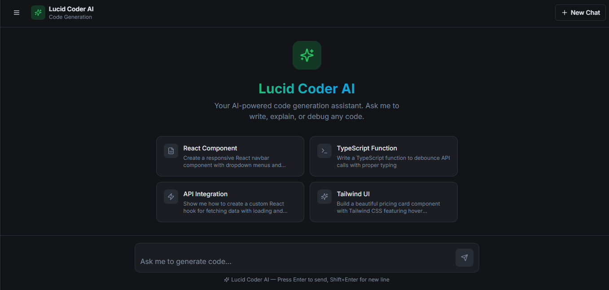

```markdown
# Code Generation AI

A full-stack web app for generating code using DeepSeek AI APIs (via OpenAI SDK compatibility).

## Features
- User inputs prompts to generate code.
- Backend handles API calls to DeepSeek.
- Frontend built with React, Vite, and Shadcn UI for a modern interface.

## Tech Stack
- **Backend**: Node.js, Express, OpenAI SDK, CORS, Dotenv.
- **Frontend**: React, Vite, Shadcn UI components, Tailwind CSS, React Hook Form, Zod, etc.
- **Dev Tools**: Nodemon, ESLint, TypeScript.

## Installation

1. Clone the repo:
   ```
   git clone <repo-url>
   cd <repo-dir>
   ```

2. Install backend dependencies (in root or backend folder):
   ```
   npm install
   ```

3. Install frontend dependencies (in frontend folder, assuming `vite_react_shadcn_ts` structure):
   ```
   cd frontend
   npm install
   cd ..
   ```

4. Create `.env` in backend root:
   ```
   DEEPSEEK_API_KEY=your-deepseek-key
   PORT=3000
   ```

## Usage

1. Start backend:
   ```
   npm run dev
   ```

2. Start frontend:
   ```
   cd frontend
   npm run dev
   ```

3. Access at `http://localhost:5173` (Vite default). Input prompts to generate code via DeepSeek API.

## Contributing
Fork, create branch, PR. Issues welcome.

## License
MIT
```

